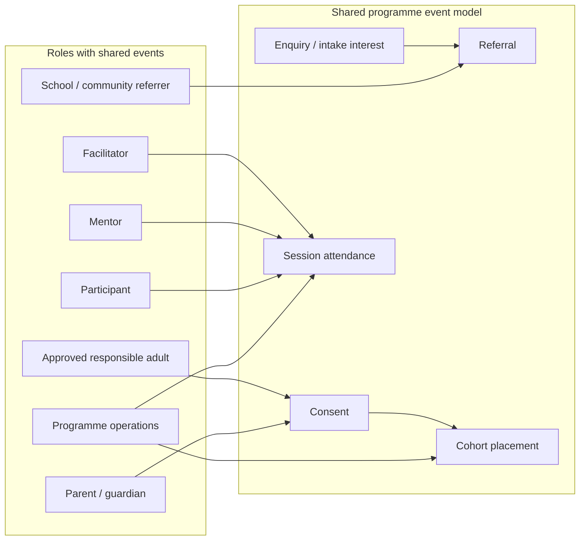

# MVP role and journey boundaries

**Milestone 3A — specification only.** Introduces future authenticated roles and their permission/data boundaries. Nothing in this document is implemented in the public codebase.

## Purpose

Define who will interact with Mecellino Haven beyond the public website, which journeys they share, and where data and permissions must stay separate — especially safeguarding casework.

## Future roles (introduced, not implemented)

| Role | Primary intent | Public site today |
|------|----------------|-------------------|
| **Participant** | Young person enrolled in a YDG track | Read-only programme info; no account |
| **Parent or legal guardian** | Consent, visibility, communication for linked minor | `/parents`; no account |
| **Approved responsible adult** | Consent or pickup authority where formally approved | Mentioned on `/parents` only |
| **Mentor** | Volunteer support under screening | `/schools`, `/contact` hints only |
| **Facilitator** | Deliver approved session content | `/schools`, `/how-ydg-works` context only |
| **School/community referrer** | Nominate or partner for cohort access | `/schools` only |
| **Programme operations** | Cohort scheduling, intake, communications | No access (`/admin` 404) |
| **Safeguarding Lead** | Org safeguarding authority; consent exceptions | Named on `/parents`; no contact route |
| **Restricted safeguarding caseworker** | Confidential case records | Not exposed publicly |
| **System administrator** | Tenant config, user lifecycle, integrations | `/admin` blocked |
| **Read-only auditor** | Compliance read access without case edit | Not exposed publicly |

---

## Core domain entities (conceptual)

These entities support a **shared state/event model** for most programme journeys:

| Entity | Description |
|--------|-------------|
| **Person** | Identity record (age, contact held under policy — not collected on public site today) |
| **Participant profile** | Programme-specific enrolment linked to Person |
| **Cohort / track placement** | Age-on-cohort-day track assignment; may reference education stage as separate field |
| **Consent record** | Parent/guardian/adult band consent with version and timestamp |
| **Referral** | School/community submission linking to Participant intake |
| **Programme event** | Session, cycle day, attendance |
| **Enquiry** | Pre-intake message (currently demo-only on web) |

**Education stage** is stored separately from **age** and **track** so referrers and operations can record, for example, a 15-year-old in a non-standard stage without forcing incorrect track messaging.

---

## Journeys that may share a common state/event model

The following journeys can reuse the same event backbone (`EnquiryCreated`, `ConsentRecorded`, `ReferralSubmitted`, `CohortAssigned`, `SessionAttended`, `WithdrawalRequested`, etc.) with role-specific views:

### Shared journey details

| Journey | Roles involved | Shared events |
|---------|----------------|---------------|
| Intake interest → placement | Referrer, Parent/guardian, Programme operations, Participant | Enquiry, referral, consent, assignment |
| Weekly delivery | Facilitator, Mentor, Participant, Programme operations | Session schedule, attendance, materials |
| Consent update | Parent/guardian, Approved responsible adult, Programme operations | Consent amended / withdrawn |
| Withdrawal | Participant (via adult if minor), Parent/guardian, Programme operations | Withdrawal requested / confirmed |
| Amusement event request (operational) | Programme operations, Sponsor contact | Event enquiry — **separate from YDG cohort** but may share enquiry table with type flag |

**Mentor** and **Facilitator** share delivery events but must not share identical permissions (facilitators lead sessions; mentors may have narrower write access).

**Approved responsible adult** shares consent events with Parent/guardian where approved, but must not inherit full guardian visibility unless policy explicitly grants it.

---

## Journeys requiring separate permissions or data boundaries

### 1. Safeguarding casework (hard boundary)

| Role | Access |
|------|--------|
| Safeguarding Lead | Case list, assign caseworkers, org-level reports |
| Restricted safeguarding caseworker | Case notes, child identifiers, third-party reports |
| Programme operations | **No default access** to case body |
| Mentor / Facilitator | **No access** to case notes |
| Parent / guardian | **Separate** concern submission view — not the same table as internal casework |
| Read-only auditor | Policy-limited read — may exclude Restricted caseworker notes |

**Separate data store or row-level policy** required. Casework events (`ConcernRaised`, `CaseOpened`, `CaseClosed`) must **not** emit to general programme dashboards visible to facilitators.

Public site today: no concern submission — boundary is forward-looking.

### 2. Screening and volunteer records (mentor/facilitator)

| Data | Boundary |
|------|----------|
| DBS / police check status, interview notes | HR/volunteer module — not visible to Participant or Referrer |
| Session assignments | Derived subset visible to Facilitator/Mentor |

Shares **Person** identity with programme users but **not** the same read API as Participant profiles.

### 3. System administration

| Capability | Boundary |
|------------|----------|
| User provisioning, role assignment, integration secrets | System administrator only |
| Safeguarding case content | Admin must not use superuser to read cases unless policy defines break-glass |

### 4. Auditor

Read-only aggregates and config snapshots. **No write.** Access to safeguarding case detail requires explicit audit policy — typically Safeguarding Lead scope only, not full admin.

### 5. Minor vs adult participant data

| Band | Consent driver | Data boundary |
|------|----------------|---------------|
| 10–17 | Parent/guardian or approved responsible adult | Participant UI may be limited; guardian visibilities |
| 18–25 | Participant self-consent (+ policy exceptions) | Direct participant messaging; reduced guardian visibility |

Same **Participant** entity type; different **permission templates** — not separate products.

---

## Permission matrix (high level)

| Capability | Participant | Parent/guardian | Approved resp. adult | Referrer | Mentor | Facilitator | Prog. ops | SG Lead | SG caseworker | Sysadmin | Auditor |
|------------|:-----------:|:---------------:|:--------------------:|:--------:|:------:|:-----------:|:---------:|:-------:|:-------------:|:--------:|:-------:|
| View own track/cohort | ✓ | linked minor | policy | nominated only | assigned | assigned | ✓ | ✗ | ✗ | ✗ | aggregate |
| Submit referral | ✗ | ✗ | ✗ | ✓ | ✗ | ✗ | ✓ | ✗ | ✗ | ✗ | ✗ |
| Record consent | ✗ | ✓ | limited | ✗ | ✗ | ✗ | ✓ | exception | ✗ | ✗ | ✗ |
| Delivery attendance | self | view | ✗ | ✗ | ✓ | ✓ | ✓ | ✗ | ✗ | ✗ | ✗ |
| Safeguarding case detail | ✗ | concern channel only | ✗ | ✗ | ✗ | ✗ | ✗ | ✓ | ✓ | break-glass | policy |
| User/role admin | ✗ | ✗ | ✗ | ✗ | ✗ | ✗ | ✗ | ✗ | ✗ | ✓ | ✗ |

✓ = intended future permission; ✗ = denied by default; “policy” = explicit policy engine rule.

---

## Public website boundary (MVP)

What remains **public and unauthenticated** for MVP after backend exists:

- Programme marketing and safeguarding **information** (current nine routes).
- Demonstration enquiry until live intake is approved for production.
- No participant PII displayed on public pages.
- No login links until auth milestone explicitly adds them.

Transition triggers (product, not dates):

1. Live enquiry → authenticated intake replaces demo form.
2. Referrer portal → subset of referral journey moves off public `/schools` CTAs.
3. Safeguarding concern → dedicated authenticated or externally hosted channel — **not** the demo enquiry form.

---

## Identity safeguard (public content)

Leadership names on `/about` are subject to the public identity safeguard in site config. Future staff directories in authenticated apps must reuse the same policy — System administrator configures visibility; not overridden by Programme operations.

---

## Related documents

- `PUBLIC_JOURNEY_MAP.md` — audience entry and exit on public routes.
- `CONTENT_AND_CTA_INVENTORY.md` — CTA classes including future authenticated hints.
- `MILESTONE_3A_DECISIONS.md` — unresolved role and journey product decisions.
- `VISUAL_COMMUNICATION_AND_SEO_PLAN.md` — per-route visual and metadata spec.
