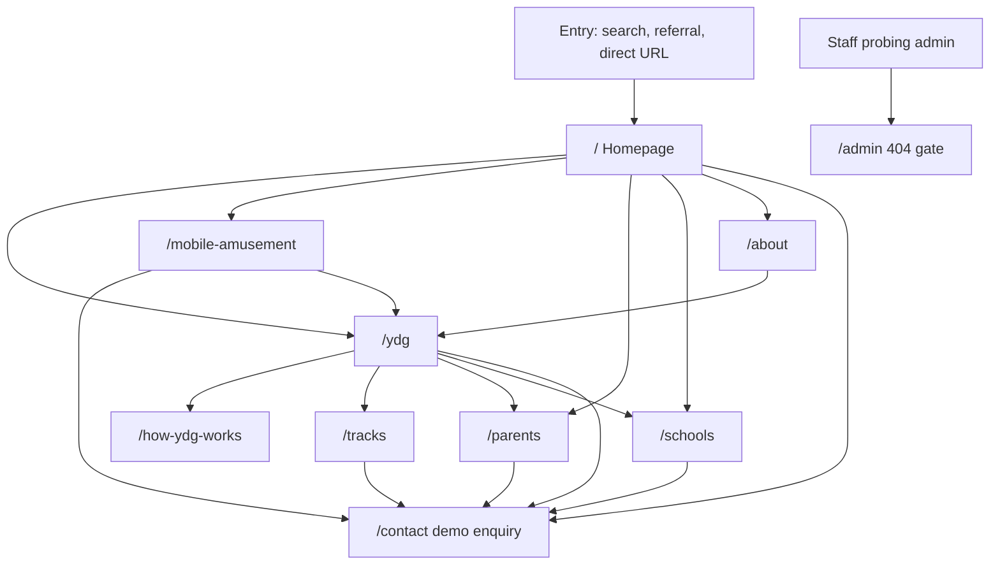

# Public journey map — Mecellino Haven / YDG

**Milestone 3A — analysis and specification only.**
This document maps the current public website experience for six audience groups across nine public routes. It does not describe authenticated journeys, backend services, or personal-data collection.

## Scope and modelling rules

### Public routes verified

| Route | Purpose |
|-------|---------|
| `/` | Homepage — dual pathways (YDG + mobile amusement), safety summary, enquiry preview |
| `/about` | Organisation identity, leadership, selection model, pilot funding, recruitment status |
| `/ydg` | YDG programme overview, audience routing, UNFOLD preview, tracks summary |
| `/how-ydg-works` | UNFOLD model and five-day delivery cycle |
| `/tracks` | Four developmental programme tracks; eligibility 13–25 at cohort start |
| `/parents` | Safeguarding, consent, supervision, complaints pointer, FAQ |
| `/mobile-amusement` | Mobile stand offering — no permanent park |
| `/schools` | School, sponsor, and mentor/facilitator relationships |
| `/contact` | Demonstration-only enquiry preview |

Legacy redirects (not separate journeys): `/attractions`, `/events`, `/visit` → `/mobile-amusement`; `/gallery` → `/`.

### Age, education stage, and programme track

These are **related but separate**. The site must not be read as implying:

- Every person aged 14 is in the same school year or education stage.
- Every person in a given education stage belongs to one programme track.
- Age alone determines readiness, placement, or consent pathway.

**Age** is used for track eligibility (counted on cohort first day) and consent bands (13–17 minor band; 18–25 adult participant band on the site).
**Education stage** is not collected on the public site; schools may refer young people at different stages within the same age band.
**Programme track** is a developmental stage. Age is used for 13–25 eligibility and consent bands only, not for automatic track selection.

---

## Audience 1 — Young people aged 13–17

### 1. Likely entry route

- **Direct:** Homepage hero or “Two pathways” → `/ydg` or `/how-ydg-works`.
- **Via family:** Parent/guardian reads `/parents` first, then shares `/ydg`, `/tracks`, or `/how-ydg-works`.
- **Via school:** Teacher or referrer sends link to `/schools` or `/ydg`; young person may land on `/how-ydg-works` or `/tracks`.
- **Via amusement:** `/mobile-amusement` → cross-link to `/ydg` (YDG not required to use the stand).
- **Navigation:** Header “Programme” cluster; no dedicated “I am a young person” nav item.

There is **no dedicated young-person landing page**. The closest “start here” content is `/how-ydg-works` (linked from `/ydg` path card “A young person”).

### 2. Information they need first

- What YDG is in plain language (not school-like, not a guarantee of a place).
- That mobile amusement and YDG are separate offerings.
- Age-appropriate track exists for them (see `/tracks`).
- Safeguarding basics: authorised adults, no one-to-one alone, who consents on their behalf (13–17 band).
- That applications are **not open** and enquiry is **demonstration-only**.

### 3. Questions the current site answers

| Question | Where answered |
|----------|----------------|
| What is YDG? | `/`, `/ydg`, `/how-ydg-works` |
| How does a week work? | `/how-ydg-works` (UNFOLD + five-day cycle) |
| Which track might fit my age? | `/tracks` (with cohort-day rule) |
| Is it safe? Who is responsible? | `/parents`, homepage safety band |
| Do I need to join YDG to use amusement? | `/mobile-amusement` (no) |
| Can I apply now? | `/about`, `/ydg`, `/contact` (recruitment closed; demo enquiry) |
| What if I have a disability or find reading hard? | `/parents` FAQ |
| Is there a fee? | `/parents` FAQ (pilot context) |

### 4. Missing or duplicated information

**Missing**

- First-person “start here for ages 13–17” page or section with reading level guidance.
- Explicit separation of **school year / education stage** from track age bands on `/tracks` and `/ydg` path cards.
- Live safeguarding reporting route (site states no operational reporting channel on public web).
- Young-person-safe exit copy on every route (partially on `/parents` only).

**Duplicated**

- UNFOLD summary on `/ydg` and full detail on `/how-ydg-works` (intentional layering).
- Safeguarding ratios and supervision on `/parents` and homepage safety band (consistent but repeated).
- “Recruitment closed” on `/about`, `/ydg`, and enquiry hints on `/contact`.

### 5. Calls to action encountered

| CTA | Location | Type |
|-----|----------|------|
| Explore YDG | `/` | Informational → `/ydg` |
| How YDG works | `/`, `/ydg` | Informational → `/how-ydg-works` |
| Programme tracks | `/ydg`, `/tracks` | Informational → `/tracks` |
| Safety & safeguarding | `/`, header mobile drawer | Informational → `/parents` |
| Enquiry preview | Header, footer, `/`, `/ydg`, `/tracks`, `/schools`, `/mobile-amusement` | Demonstration-only → `/contact` |
| Mobile amusement | `/` | Informational → `/mobile-amusement` |

No CTA submits an application or creates a participant record.

### 6. CTA operational status (summary)

All enquiry CTAs lead to a **demonstration-only** form (`EnquiryForm` — no transmission or storage). No operational intake, placement, or account creation.

### 7. Safeguarding and consent messages relevant

- Homepage: authorised adults, no one adult alone with under-18s, consent before participation.
- `/parents`: full consent model (13–17 minor band; 18–25 adult band); exception naming Safeguarding Lead role (no public contact route); emergency services guidance; supervision ratios; conduct expectations.
- `/contact`: demonstration acknowledgement required; guardian fields when “under 18” selected on form (form wording, not identical to site consent band 13–17).
- `/schools`: conduct and safeguarding expectations for referrals.

**Product note:** Supervision copy on `/parents` uses “under-18s”; consent section uses “ages 13–17”. Both are accurate in context but terminology differs — see `MILESTONE_3A_DECISIONS.md`.

### 8. Safe exit or escalation route

- **Immediate danger:** `/parents` directs to emergency services (no org-specific hotline published).
- **Leave the site:** Standard browser navigation; no persistent session on public routes.
- **Raise a concern with the organisation:** No live operational channel on the public site; complaints pointer in footer → `/parents` (informational, not a case-management workflow).
- **Enquiry form:** Does not connect to safeguarding staff; explicitly demo-only.

### 9. Intended next step after the public website

When authenticated programme services exist (out of scope for 3A):

1. Parent/guardian or approved responsible adult completes consent and intake (Participant + Parent/guardian roles).
2. School/community referrer may submit structured referral (referrer role).
3. Programme operations assigns track/cohort considering age on cohort day and recorded education context — not inferred from age alone.

Until then: read `/parents` and `/tracks` with a trusted adult; use demonstration enquiry only to preview UX.

---

## Audience 2 — Young adults aged 18–25

### 1. Likely entry route

- Homepage → `/ydg` → `/tracks` (Track 18–25) or `/how-ydg-works`.
- `/about` for credibility (leadership, selection model).
- `/contact` with audience “A young person or family” or “I want help applying” (demo).
- Social or peer link directly to `/tracks`.

### 2. Information they need first

- Track 18–25 scope (life skills, work readiness — not employment guarantee).
- Self-consent band (18–25) vs parent consent for minors — see `/parents`.
- Recruitment closed; no live application.
- YDG is voluntary structured programme, not accredited qualification unless stated elsewhere (not claimed on site).

### 3. Questions the current site answers

| Question | Where answered |
|----------|----------------|
| Am I in the right age band? | `/tracks` Track 18–25 |
| Do I need a parent to consent? | `/parents` (18–25 adult participant consent band) |
| How is a week structured? | `/how-ydg-works` |
| Is there a job at the end? | Not guaranteed; `/about` selection model avoids outcome guarantees |
| Can I enquire? | `/contact` (demo only) |

### 4. Missing or duplicated information

**Missing**

- Explicit “young adult” pathway card ( `/ydg` lumps “A young person” as 13–25 without stage distinction).
- Clarification that education stage (e.g. university, NEET, apprentice) does not map 1:1 to Track 18–25.

**Duplicated**

- Age track tables on `/ydg` and `/tracks`.
- Consent bands explained only on `/parents` (young adults may not visit that route first).

### 5–6. CTAs and operational status

Same global CTAs as Audience 1. Enquiry form “under 18?” branch less relevant; guardian fields hidden when “no”. All enquiry: **demonstration-only**.

### 7. Safeguarding and consent

- Adult participant consent band (18–25) on `/parents`.
- Conduct and supervision rules still apply during programme delivery (described generally on `/parents`).
- Enquiry demo consent checkbox required.

### 8. Safe exit / escalation

Same as Audience 1 — no operational safeguarding form; emergency services on `/parents`.

### 9. Next step after public website

Future: self-service or assisted intake under Participant role with adult consent record; optional referrer context. Not available on current public site.

---

## Audience 3 — Parents, guardians, and approved responsible adults

### 1. Likely entry route

- Homepage “For families” → `/parents`.
- `/ydg` path card “A parent or guardian” → `/parents`.
- Footer “Complaints” → `/parents`.
- Header mobile “Safety & Safeguarding” → `/parents`.
- `/contact` audience “A young person or family”.

**Approved responsible adult** is referenced in consent copy on `/parents` but has **no separate route or nav label**.

### 2. Information they need first

- Safeguarding model, supervision ratios, consent before participation.
- Who can consent (parent, legal guardian, approved responsible adult).
- Fees, media, disability, school requirement, selection, withdrawal — FAQ on `/parents`.
- Recruitment closed; enquiry is preview only.
- Difference between YDG and mobile amusement.

### 3. Questions the current site answers

See Audience 1 FAQ table plus:

| Question | Where answered |
|----------|----------------|
| Who are the leaders? | `/about` |
| How are participants selected? | `/about`, `/parents` FAQ |
| What is the pilot / Foundation track? | `/about`, `/parents` (14–15 ratios) |
| Can I complain? | Footer → `/parents` (informational pointer) |

### 4. Missing or duplicated information

**Missing**

- Operational complaints and safeguarding reporting workflow (explicitly not live).
- Definition workflow for “approved responsible adult” (named but not process-described).
- Contact details for Safeguarding Lead (intentionally omitted).

**Duplicated**

- Safeguarding content on `/` and `/parents`.
- Selection / not-a-guarantee messaging on `/about`, `/ydg`, `/parents`.

### 5. CTAs

| CTA | Type |
|-----|------|
| `/parents` internal anchors (consent, FAQ) | Informational |
| Enquiry preview | Demonstration-only → `/contact` |
| Complaints (footer) | Informational → `/parents` |
| Programme tracks, how it works | Informational |

### 7. Safeguarding and consent

Primary audience for `/parents` content: consent bands, exception process (Safeguarding Lead role name only), emergency services, media FAQ, withdrawal.

### 8. Safe exit / escalation

Emergency services; no org escalation channel on web; can leave site without account. Demo enquiry does not create a case.

### 9. Next step after public website

Future Parent/guardian and Approved responsible adult roles: consent signing, participant linking, visibility into cohort status. Boundaries in `MVP_ROLE_AND_JOURNEY_BOUNDARIES.md`.

---

## Audience 4 — Schools and community referrers

### 1. Likely entry route

- `/schools` (header “Schools & partners”).
- Homepage pathway “Schools & referrers” → `/schools`.
- `/ydg` path card “A school or referrer” → `/schools`.
- `/contact` audience “A school” or “I want help applying”.

### 2. Information they need first

- Three relationship types: nomination, partnership, supervised visit sponsorship.
- Conduct and safeguarding alignment expectations.
- YDG vs amusement distinction.
- No live referral form or CRM integration on public site.

### 3. Questions the current site answers

| Question | Where answered |
|----------|----------------|
| How can our school engage? | `/schools` (three types) |
| What behaviour is expected? | `/schools` conduct section |
| Programme structure for conversations with leadership? | `/how-ydg-works`, `/tracks` |
| Can we refer a young person now? | Demo enquiry only; recruitment closed |

### 4. Missing or duplicated information

**Missing**

- Referral form, SLAs, timetabling, or partnership agreement previews.
- Community referrer identity beyond “school or referrer” label (e.g. youth clubs) — only generic wording.

**Duplicated**

- School-oriented CTAs on `/schools` and `/ydg` path card.

### 5. CTAs

| CTA | Type |
|-----|------|
| Preview enquiry (school / sponsor variants on page) | Demonstration-only → `/contact` |
| Programme links in body copy | Informational |

### 7. Safeguarding

`/schools` conduct rules; cross-reference to `/parents` for full model. Referrers must not bypass parent consent for minors.

### 8. Safe exit / escalation

No operational referrer portal; emergency and safeguarding escalation same as public `/parents` limits.

### 9. Next step after public website

Future School/community referrer role: structured referral, cohort visibility within permission boundaries. Shared events with Participant intake where consent allows — see role boundaries doc.

---

## Audience 5 — Mentors and facilitators

### 1. Likely entry route

- `/schools` (mentor/facilitator relationship type and enquiry CTA).
- `/contact` audience “A mentor or facilitator”.
- **No** dedicated `/mentors` route or `/ydg` path card.

### 2. Information they need first

- Volunteering requires screening and training first (`/schools`, enquiry hint).
- Safeguarding and conduct expectations apply.
- No open recruitment or application workflow on site (`/about`: recruitment closed).

### 3. Questions the current site answers

| Question | Where answered |
|----------|----------------|
| Can I volunteer as mentor? | `/schools`, `/contact` hints |
| What comes first? | Screening and training (`/schools`, form hint) |
| Who runs the programme? | `/about` leadership |

### 4. Missing or duplicated information

**Missing**

- Dedicated mentor journey page (role description, time commitment, DBS/safeguarding training outline — without inventing dates).
- Distinction between Mentor and Facilitator roles (not defined on public site).

**Duplicated**

- Mentor CTA only on `/schools` and `/contact`.

### 5. CTAs

Preview enquiry (mentor) on `/schools` → `/contact` — **demonstration-only**.

### 7. Safeguarding

Screening emphasised; must align with `/parents` supervision model during delivery.

### 8. Safe exit / escalation

Same public limits; no volunteer portal.

### 9. Next step after public website

Future Mentor and Facilitator roles with separate permission sets from Participant data; onboarding workflow authenticated. See `MVP_ROLE_AND_JOURNEY_BOUNDARIES.md`.

---

## Audience 6 — Programme and safeguarding staff

### 1. Likely entry route

Staff are not a primary public audience. Likely paths:

- `/about` (leadership names and roles — public identity safeguard applies).
- `/parents` (operational safeguarding copy they must align delivery with).
- `/admin/*` returns **404** (operational gate visible — no admin UI on public site).

### 2. Information they need first

- Public messaging constraints (`config/site.ts` identity safeguard, demo enquiry, recruitment closed).
- What families and schools are told vs what is not yet operational.

### 3. Questions the current site answers

| Question | Where answered |
|----------|----------------|
| Public programme boundaries? | `/about`, `/ydg`, `/parents` |
| Pilot vs broader delivery? | `/about`, `/parents` ratios |
| Is admin available? | `/admin` blocked (404) |

### 4. Missing or duplicated information

**Missing (by design for 3A)**

- Staff intranet, casework tools, Safeguarding Lead contact routes.
- Authenticated Safeguarding Lead and Restricted safeguarding caseworker journeys.

**Duplicated**

- Leadership on `/about` only.

### 5. CTAs

No staff-specific CTAs. `/admin` is **operationally blocked** (404).

### 7. Safeguarding

Public copy defines Safeguarding Lead as consent exception authority (name only). Casework boundaries not exposed publicly.

### 8. Safe exit / escalation

Staff use non-public channels (not documented in 3A — not invented).

### 9. Next step after public website

Future Programme operations, Safeguarding Lead, Restricted safeguarding caseworker, System administrator roles — see role boundaries doc. Public site remains read-only reference for families.

---

## Cross-audience journey diagram (public phase)

---

## Verification checklist (Milestone 3A)

- [x] All nine public routes reviewed.
- [x] Navigation and CTA targets traced via `config/routes.ts`, `SiteHeader`, `SiteFooter`, page content.
- [x] Enquiry confirmed demonstration-only (`EnquiryForm`, `demoEnquiryNotice`).
- [x] Operational gates: recruitment closed, no live applications, `/admin` 404, no safeguarding submission route.
- [x] Age / consent terminology inconsistencies recorded (not fixed in 3A).
- [x] No contact details, dates, venues, or guarantees invented in this document.
