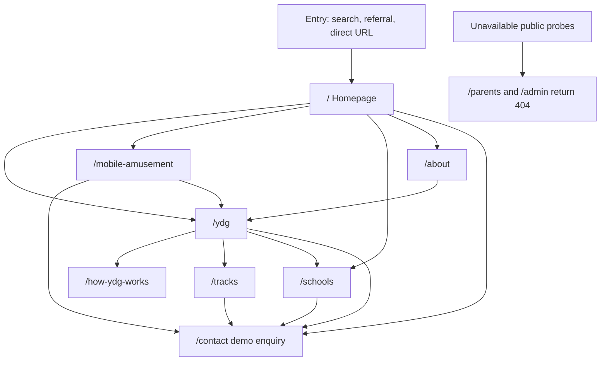

# Public journey map — Mecellino Haven / YDG

**Milestone 3A — analysis and specification only.**
This document maps the current public website experience for six audience groups across the live public routes. It does not describe authenticated journeys, backend services, or personal-data collection.

`/parents` is **intentionally unavailable** and returns **404**. It is not a live public family, consent or safeguarding route. Detailed guardian approval, consent and safeguarding guidance is reserved for controlled participant onboarding. Public pages may state high-level eligibility and guardian-approval requirements. Public pages must not expose safeguarding escalation procedures, private contacts or controlled onboarding instructions. No public navigation or CTA targets `/parents`. No replacement public safeguarding route is introduced.

## Scope and modelling rules

### Public routes verified

| Route | Purpose |
|-------|---------|
| `/` | Homepage — dual pathways (YDG + mobile amusement), high-level eligibility and guardian-approval requirements, enquiry preview |
| `/about` | Organisation identity, leadership, selection model, pilot funding, recruitment status |
| `/ydg` | YDG programme overview, audience routing, UNFOLD preview, tracks summary |
| `/how-ydg-works` | UNFOLD model and five-day delivery cycle |
| `/tracks` | Four developmental programme tracks; eligibility 13–25 at cohort start |
| `/mobile-amusement` | Mobile stand offering — no permanent park |
| `/schools` | School, sponsor, and mentor/facilitator relationships |
| `/contact` | Demonstration-only enquiry preview |

**Not a public journey:** `/parents` returns 404. Reserved onboarding copy is held in `RESERVED_PARENT_ONBOARDING_CONTENT.md` and is not published.

Legacy redirects (not separate journeys): `/attractions`, `/events`, `/visit` → `/mobile-amusement`; `/gallery` → `/`. `/ydg`, `/how-ydg-works` and `/tracks` remain available through their capacity-building canonical paths.

### Age, education stage, and programme track

These are **related but separate**. The site must not be read as implying:

- Every person aged 14 is in the same school year or education stage.
- Every person in a given education stage belongs to one programme track.
- Age alone determines readiness, placement, or consent pathway.

**Age** is used for track eligibility (counted on cohort first day) and consent bands (13–17 minor band; 18–25 adult participant band on the site).
**Education stage** is not collected on the public site; schools may refer young people at different stages within the same age band.
**Programme track** is a developmental stage. Age is used for 13–25 eligibility and consent bands only, not for automatic track selection.

---

## Audience 1 — Young people aged 13–17

### 1. Likely entry route

- **Direct:** Homepage hero or “Two pathways” → `/ydg` or `/how-ydg-works`.
- **Via family:** Parent/guardian reads public YDG pages (`/ydg`, `/tracks`, `/how-ydg-works`) for high-level eligibility and guardian-approval requirements. Detailed consent and safeguarding guidance is reserved for controlled onboarding.
- **Via school:** Teacher or referrer sends link to `/schools` or `/ydg`; young person may land on `/how-ydg-works` or `/tracks`.
- **Via amusement:** `/mobile-amusement` → cross-link to `/ydg` (YDG not required to use the stand).
- **Navigation:** Header “Programme” cluster; no dedicated “I am a young person” nav item.

There is **no dedicated young-person landing page**. The closest “start here” content is `/how-ydg-works` (linked from `/ydg` path card “A young person”).

### 2. Information they need first

- What YDG is in plain language (not school-like, not a guarantee of a place).
- That mobile amusement and YDG are separate offerings.
- Age-appropriate track exists for them (see `/tracks`).
- High-level guardian-approval requirement for every participant, and that detailed consent guidance is reserved for controlled onboarding.
- That applications are **not open** and enquiry is **demonstration-only**.

### 3. Questions the current site answers

| Question | Where answered |
|----------|----------------|
| What is YDG? | `/`, `/ydg`, `/how-ydg-works` |
| How does a week work? | `/how-ydg-works` (UNFOLD + five-day cycle) |
| Which track might fit my age? | `/tracks` (with cohort-day rule) |
| Is guardian approval required? | Public YDG pages state high-level approval for every participant |
| Do I need to join YDG to use amusement? | `/mobile-amusement` (no) |
| Can I apply now? | `/about`, `/ydg`, `/contact` (recruitment closed; demo enquiry) |
| What if I have a disability or find reading hard? | Reserved for controlled onboarding; not a public FAQ |
| Is there a fee? | Public programme pages (Foundation pilot context); detailed fee answers reserved for onboarding |

### 4. Missing or duplicated information

**Missing**

- First-person “start here for ages 13–17” page or section with reading level guidance.
- Explicit separation of **school year / education stage** from track age bands on `/tracks` and `/ydg` path cards.
- Live safeguarding reporting route (none is published; no replacement public safeguarding route is introduced).
- Young-person-safe exit copy on every route.

**Duplicated**

- UNFOLD summary on `/ydg` and full detail on `/how-ydg-works` (intentional layering).
- High-level eligibility and guardian-approval wording across public YDG pages.
- “Recruitment closed” on `/about`, `/ydg`, and enquiry hints on `/contact`.

### 5. Calls to action encountered

| CTA | Location | Type |
|-----|----------|------|
| Explore YDG | `/` | Informational → `/ydg` |
| How YDG works | `/`, `/ydg` | Informational → `/how-ydg-works` |
| Programme tracks | `/ydg`, `/tracks` | Informational → `/tracks` |
| High-level eligibility and guardian approval | `/`, `/ydg` | Informational — no `/parents` target |
| Enquiry preview | Header, footer, `/`, `/ydg`, `/tracks`, `/schools`, `/mobile-amusement` | Demonstration-only → `/contact` |
| Mobile amusement | `/` | Informational → `/mobile-amusement` |

No CTA submits an application or creates a participant record.

### 6. CTA operational status (summary)

All enquiry CTAs lead to a **demonstration-only** form (`EnquiryForm` — no transmission or storage). No operational intake, placement, or account creation.

### 7. Safeguarding and consent messages relevant

- Public YDG pages: high-level eligibility (13–25) and guardian-approval requirement for every participant.
- Detailed consent bands, exception process, supervision ratios and safeguarding procedures are reserved for controlled onboarding. They are not published on a public `/parents` route.
- `/contact`: demonstration acknowledgement required; guardian fields when “under 18” selected on form (form wording, not identical to site consent band 13–17).
- `/schools`: high-level conduct expectations for referrals. No public safeguarding escalation procedure.

**Product note:** `/parents` returns 404. Reserved onboarding copy may still distinguish “under-18s” supervision from “ages 13–17” consent; that wording is not a public route.

### 8. Safe exit or escalation route

- **Immediate danger:** Public pages do not publish an organisational hotline or safeguarding escalation procedure.
- **Leave the site:** Standard browser navigation; no persistent session on public routes.
- **Raise a concern with the organisation:** No live operational channel and no public `/parents` pointer.
- **Enquiry form:** Does not connect to safeguarding staff; explicitly demo-only.

### 9. Intended next step after the public website

When authenticated programme services exist (out of scope for 3A):

1. Parent/guardian or approved responsible adult completes consent and intake (Participant + Parent/guardian roles).
2. School/community referrer may submit structured referral (referrer role).
3. Programme operations assigns track/cohort considering age on cohort day and recorded education context — not inferred from age alone.

Until then: read public YDG pages with a trusted adult; use demonstration enquiry only to preview UX. Detailed consent and safeguarding guidance remains reserved for controlled onboarding.

---

## Audience 2 — Young adults aged 18–25

### 1. Likely entry route

- Homepage → `/ydg` → `/tracks` (Track 18–25) or `/how-ydg-works`.
- `/about` for credibility (leadership, selection model).
- `/contact` with audience “A young person or family” or “I want help applying” (demo).
- Social or peer link directly to `/tracks`.

### 2. Information they need first

- Track 18–25 scope (life skills, work readiness — not employment guarantee).
- Guardian approval applies to every participant. Detailed 18–25 legal-consent and 13–17 programme-consent instruments are reserved for controlled onboarding.
- Recruitment closed; no live application.
- YDG is voluntary structured programme, not accredited qualification unless stated elsewhere (not claimed on site).

### 3. Questions the current site answers

| Question | Where answered |
|----------|----------------|
| Am I in the right age band? | `/tracks` Track 18–25 |
| Do I need a parent to consent? | Public pages: guardian approval applies to everyone; detailed instruments reserved for onboarding |
| How is a week structured? | `/how-ydg-works` |
| Is there a job at the end? | Not guaranteed; `/about` selection model avoids outcome guarantees |
| Can I enquire? | `/contact` (demo only) |

### 4. Missing or duplicated information

**Missing**

- Explicit “young adult” pathway card ( `/ydg` lumps “A young person” as 13–25 without stage distinction).
- Clarification that education stage (e.g. university, NEET, apprentice) does not map 1:1 to Track 18–25.

**Duplicated**

- Age track tables on `/ydg` and `/tracks`.
- Detailed consent-band instruments are reserved for controlled onboarding, not a public `/parents` page.

### 5–6. CTAs and operational status

Same global CTAs as Audience 1. Enquiry form “under 18?” branch less relevant; guardian fields hidden when “no”. All enquiry: **demonstration-only**.

### 7. Safeguarding and consent

- Guardian approval still applies to 18–25 participants. Detailed adult legal-consent instruments are reserved for controlled onboarding.
- Public pages do not publish supervision ratios or safeguarding escalation procedures.
- Enquiry demo consent checkbox required.

### 8. Safe exit / escalation

Same as Audience 1 — no operational safeguarding form and no public `/parents` route.

### 9. Next step after public website

Future: self-service or assisted intake under Participant role with adult consent record; optional referrer context. Not available on current public site.

---

## Audience 3 — Parents, guardians, and approved responsible adults

### 1. Likely entry route

- Homepage and `/ydg` for high-level eligibility and guardian-approval requirements.
- `/contact` audience “A young person or family”.
- There is **no** public Families, Safety, Complaints or `/parents` navigation target.

**Approved responsible adult** is a reserved-onboarding concept. It has **no public route or nav label**.

### 2. Information they need first

- High-level eligibility (13–25) and that guardian approval applies to every participant.
- That detailed consent, media, fee and safeguarding guidance is reserved for controlled onboarding.
- Recruitment closed; enquiry is preview only.
- Difference between YDG and mobile amusement.

### 3. Questions the current site answers

See Audience 1 FAQ table plus:

| Question | Where answered |
|----------|----------------|
| Who are the leaders? | `/about` |
| How are participants selected? | `/about` (interview and documented panel; no aptitude score) |
| What is the pilot / Foundation track? | `/about` |
| Can I complain? | No public complaints or `/parents` pointer |

### 4. Missing or duplicated information

**Missing**

- Operational complaints and safeguarding reporting workflow (explicitly not live).
- Definition workflow for “approved responsible adult” (named but not process-described).
- Contact details for Safeguarding Lead (intentionally omitted).

**Duplicated**

- High-level eligibility and guardian-approval wording on `/` and `/ydg`.
- Selection / not-a-guarantee messaging on `/about` and `/ydg`.

### 5. CTAs

| CTA | Type |
|-----|------|
| Enquiry preview | Demonstration-only → `/contact` |
| Programme tracks, how it works | Informational |

No public CTA targets `/parents`.

### 7. Safeguarding and consent

Public pages state only high-level eligibility and guardian-approval requirements. Detailed consent bands, exception process, media FAQ and withdrawal instruments are reserved for controlled onboarding.

### 8. Safe exit / escalation

Emergency services; no org escalation channel on web; can leave site without account. Demo enquiry does not create a case.

### 9. Next step after public website

Future Parent/guardian and Approved responsible adult roles: consent signing, participant linking, visibility into cohort status. Boundaries in `MVP_ROLE_AND_JOURNEY_BOUNDARIES.md`.

---

## Audience 4 — Schools and community referrers

### 1. Likely entry route

- `/schools` (header “Schools & partners”).
- Homepage pathway “Schools & referrers” → `/schools`.
- `/ydg` path card “A school or referrer” → `/schools`.
- `/contact` audience “A school” or “I want help applying”.

### 2. Information they need first

- Three relationship types: nomination, partnership, supervised visit sponsorship.
- Conduct and safeguarding alignment expectations.
- YDG vs amusement distinction.
- No live referral form or CRM integration on public site.

### 3. Questions the current site answers

| Question | Where answered |
|----------|----------------|
| How can our school engage? | `/schools` (three types) |
| What behaviour is expected? | `/schools` conduct section |
| Programme structure for conversations with leadership? | `/how-ydg-works`, `/tracks` |
| Can we refer a young person now? | Demo enquiry only; recruitment closed |

### 4. Missing or duplicated information

**Missing**

- Referral form, SLAs, timetabling, or partnership agreement previews.
- Community referrer identity beyond “school or referrer” label (e.g. youth clubs) — only generic wording.

**Duplicated**

- School-oriented CTAs on `/schools` and `/ydg` path card.

### 5. CTAs

| CTA | Type |
|-----|------|
| Preview enquiry (school / sponsor variants on page) | Demonstration-only → `/contact` |
| Programme links in body copy | Informational |

### 7. Safeguarding

`/schools` states high-level conduct expectations. Referrers must not bypass guardian approval. Detailed safeguarding procedures are reserved for controlled onboarding and are not published on a public `/parents` route.

### 8. Safe exit / escalation

No operational referrer portal. No public safeguarding escalation procedure.

### 9. Next step after public website

Future School/community referrer role: structured referral, cohort visibility within permission boundaries. Shared events with Participant intake where consent allows — see role boundaries doc.

---

## Audience 5 — Mentors and facilitators

### 1. Likely entry route

- `/schools` (mentor/facilitator relationship type and enquiry CTA).
- `/contact` audience “A mentor or facilitator”.
- **No** dedicated `/mentors` route or `/ydg` path card.

### 2. Information they need first

- Volunteering requires screening and training first (`/schools`, enquiry hint).
- Safeguarding and conduct expectations apply.
- No open recruitment or application workflow on site (`/about`: recruitment closed).

### 3. Questions the current site answers

| Question | Where answered |
|----------|----------------|
| Can I volunteer as mentor? | `/schools`, `/contact` hints |
| What comes first? | Screening and training (`/schools`, form hint) |
| Who runs the programme? | `/about` leadership |

### 4. Missing or duplicated information

**Missing**

- Dedicated mentor journey page (role description, time commitment, DBS/safeguarding training outline — without inventing dates).
- Distinction between Mentor and Facilitator roles (not defined on public site).

**Duplicated**

- Mentor CTA only on `/schools` and `/contact`.

### 5. CTAs

Preview enquiry (mentor) on `/schools` → `/contact` — **demonstration-only**.

### 7. Safeguarding

Screening emphasised. Detailed supervision rules are reserved for controlled onboarding and staff channels.

### 8. Safe exit / escalation

Same public limits; no volunteer portal.

### 9. Next step after public website

Future Mentor and Facilitator roles with separate permission sets from Participant data; onboarding workflow authenticated. See `MVP_ROLE_AND_JOURNEY_BOUNDARIES.md`.

---

## Audience 6 — Programme and safeguarding staff

### 1. Likely entry route

Staff are not a primary public audience. Likely paths:

- `/about` (leadership names and roles — public identity safeguard applies).
- Reserved onboarding records (not a public `/parents` route) for delivery alignment.
- `/admin/*` and `/parents` return **404**.

### 2. Information they need first

- Public messaging constraints (`config/site.ts` identity safeguard, demo enquiry, recruitment closed).
- What families and schools are told vs what is not yet operational.

### 3. Questions the current site answers

| Question | Where answered |
|----------|----------------|
| Public programme boundaries? | `/about`, `/ydg` |
| Pilot vs broader delivery? | `/about` |
| Is admin available? | `/admin` blocked (404) |

### 4. Missing or duplicated information

**Missing (by design for 3A)**

- Staff intranet, casework tools, Safeguarding Lead contact routes.
- Authenticated Safeguarding Lead and Restricted safeguarding caseworker journeys.

**Duplicated**

- Leadership on `/about` only.

### 5. CTAs

No staff-specific CTAs. `/admin` is **operationally blocked** (404).

### 7. Safeguarding

Public copy defines Safeguarding Lead as consent exception authority (name only). Casework boundaries not exposed publicly.

### 8. Safe exit / escalation

Staff use non-public channels (not documented in 3A — not invented).

### 9. Next step after public website

Future Programme operations, Safeguarding Lead, Restricted safeguarding caseworker, System administrator roles — see role boundaries doc. Public site remains read-only reference for families.

---

## Cross-audience journey diagram (public phase)

---

## Verification checklist (Milestone 3A)

- [x] Live public routes reviewed. `/parents` is recorded as an intentional 404, not a public journey.
- [x] Navigation and CTA targets traced; no public navigation or CTA targets `/parents`.
- [x] Enquiry confirmed demonstration-only (`EnquiryForm`, `demoEnquiryNotice`).
- [x] Operational gates: recruitment closed, no live applications, `/admin` 404, `/parents` 404, no public safeguarding submission or escalation route.
- [x] Detailed consent and safeguarding guidance reserved for controlled onboarding.
- [x] No contact details, dates, venues, or guarantees invented in this document.
