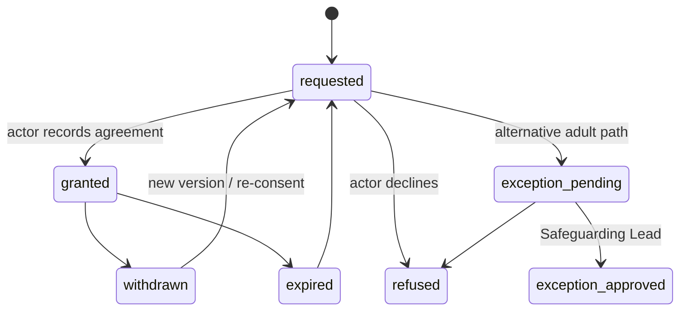

# R2 — Consent, safeguarding and privacy gates

**Milestone:** Reconstruction R2 — specification only.\
**Extends:** `MVP_SECURITY_PRIVACY_AND_SAFEGUARDING_BOUNDARIES.md`, public `/parents` instruments, 3A P4 (concern channel still unapproved).\
**Does not:** invent a public safeguarding-reporting route, collect personal data, or implement casework.

Journey roles and lifecycle: `R2_YDG_LONGITUDINAL_JOURNEY.md`.\
Experience and backend: `R2_EXPERIENCE_IA_AND_IMPLEMENTATION.md`.

---

## 5. Consent, assent, acknowledgement and media lifecycle

Each instrument is its own `ConsentRecord`: band, text version shown, timestamp, actor, method, status. Adult acknowledgement never overrides an 18–25 participant’s consent or withdrawal.

### Who records what

| Instrument | 10–17 | 18–25 | Required for participation |
|------------|-------|-------|----------------------------|
| Programme consent | Parent or legal guardian, or SL-approved alternative adult | — | Yes |
| Participant assent | Participant | — | Yes |
| Participant legal consent | — | Participant | Yes |
| Adult acknowledgement / approval | — | Parent, guardian or approved responsible adult | Yes as an **organisational eligibility** condition, not as legal consent |
| First aid / emergency care | Per `/parents` | Per `/parents` | Yes |
| Supervised group trips | Per `/parents` | Per `/parents` | Yes |
| Transport | Per `/parents` | Per `/parents` | Yes when used |
| Code of conduct | Per `/parents` | Per `/parents` | Yes |
| Media (photo, audio, video) | Guardian or approved alternative; optional | Participant; optional | **No** |

Assent (10–17) and legal consent (18–25) may be declined or withdrawn without penalty. Withdrawal of a required instrument ends the current episode; it does not erase history.

### Record status

`requested` \| `granted` \| `withdrawn` \| `expired` \| `exception_pending` \| `exception_approved` \| `refused`

### Lifecycle rules

1. **10–17:** no `enrolled` or `active` episode without current programme consent **and** current assent. Return from `deferred` to `enrolled` requires those instruments still to be valid.
2. **18–25:** no `enrolled` or `active` episode without current legal consent **and** current adult acknowledgement. Acknowledgement is eligibility, not a veto after the participant has withdrawn consent. Return from `deferred` to `enrolled` requires both still to be valid.
3. **Media** is a separate optional instrument. Refusal or withdrawal does not affect place. Withdrawal starts an approved restriction/removal workflow for photo, audio or video evidence only; it does not erase the rest of the programme record.
4. **Identity / telephone reuse:** participant and approver must not share the same identity or phone unless an independently verified accessibility accommodation is recorded.
5. **Alternative responsible adult:** only the Safeguarding Lead may approve a documented exception before participation. Do not publish a public contact route for this.
6. **Ages 10–12:** Discovery Gateway remains 10–13. Age-specific safeguarding approval is required before any recruitment of 10–12 year olds.
7. **No minor personal information** is stored until Gate M in `MVP_IMPLEMENTATION_ROADMAP.md` is closed.
8. **R2 itself stores nothing.** Demonstration enquiry and the temporary public enquiry address remain as R1 defined them. They are not consent capture and not a safeguarding channel.
9. **Episode withdrawal vs instrument withdrawal.** Consent-record status `withdrawn` on a required instrument ends the **current participation episode** as `withdrawn`. That episode status is terminal. Re-entry is a new linked episode with **current** instruments; it does not revive the old episode or delete historical consent, attendance, audit or safeguarding records. See `R2_YDG_LONGITUDINAL_JOURNEY.md`.

Instrument status only (not participation-episode status). A new version after instrument withdrawal is recorded on a **new or continuing episode as appropriate**; it does not reopen a `withdrawn` participation episode.

---

## 6. Safeguarding-data segregation and escalation

### Stores

| Context | Contents | Default accessors |
|---------|----------|-------------------|
| Programme / journey | Profile, enrolment, attendance, activity evidence, reviews, showcases | Role matrix in the journey architecture |
| Private reflections | Participant-owned diary-class evidence | Owning participant only |
| Restriction markers | Minimal operational flags only | Ops / assigned delivery as **marker**, never the case |
| Safeguarding casework | Concern, case, restricted notes, third-party reports, case-context identifiers | Safeguarding Lead and assigned restricted caseworker |
| Volunteer / alumni screening | Checks, interview notes | HR-equivalent ops and SL as policy |
| Audit | Privileged actions | System administrator + policy readers |

Case events must **not** appear on mentor, facilitator, parent, institutional, alumni or general operations dashboards.

### Escalation boundaries

| Signal | Goes to | Must not go to |
|--------|---------|----------------|
| Immediate danger | Emergency services, as already stated on `/parents` | Public enquiry form, `opheenana@gmail.com`, My Journey chat |
| Programme welfare observation | Structured, auditable facilitator/ops note; escalate to SL if it is a concern | Case table, family feed, institutional partner |
| Safeguarding concern | Approved concern channel **once 3A P4 is decided** | Demo form, general enquiry mailbox, mentor inbox |
| Case notes | SL / assigned caseworker | Mentors, facilitators, parents, ARAs, institutions, alumni, ordinary ops |
| Restriction marker | Assigned delivery, as a flag | Anyone as a case narrative |
| Break-glass | Time-bounded, dual-controlled, audited; not a standing admin privilege | Automatic `system_administrator` access |

### Communication involving minors

- Structured, moderated and auditable.
- Tied to an assigned activity, review or approved announcement.
- Visible to programme operations under policy.
- **No direct messaging** and **no broad community feeds** in the first authenticated release.
- Staff must not move programme conversation onto unmanaged personal channels as a substitute for the product.

Parents and ARAs do not read internal case notes. A future family concern channel is a separate submission view, not the case table, and is not implied until formally approved.

---

## 11. Privacy, retention, auditability and access control

**Must be owner/legal approved before any implementation that stores personal data.** Periods are not invented here.

### Access control (every server mutation)

Fail closed unless all are true:

1. Valid server-side session (except an approved public write, none of which collect YDG PII today).
2. Role from protected `app_metadata` or server-owned `RoleAssignment` — never editable `user_metadata`.
3. Relationship or assignment scope (linked minor, assigned cohort, assigned case).
4. Resource state (participation, instruments, enrolment, evidence class).
5. Context isolation (programme vs private reflection vs casework vs screening).
6. Audit write for privileged actions.

“Any authenticated user” is not a permission. The dormant `booking_inquiries` table is not a YDG, consent or case template.

### Audit (append-only)

Always audit: invite, sign-in class, lockout, deactivation, role grant/revoke, scope change, consent exception, identity-reuse accommodation, `ParticipationStatusChanged`, `EnrolmentEnded`, `EnrolmentTransferred`, `TransitionReviewCompleted`, enrolment override, personal-data export, restriction-marker changes, case open/assign/close, break-glass, service-role use, and later file upload/access/replace/delete.

Durable audit storage with fail-closed sink failure is already a **hosted-auth prerequisite** from 4B. R2 does not add a sink. Re-entry, withdrawal and transfer must leave the previous episode, its attendance, consent changes and safeguarding retention **intact**.

### Retention classes (labels only)

| Class | Examples | Boundary |
|-------|----------|----------|
| Transient pre-intake | Live enquiry before enrolment | Short; delete or anonymise if not progressed |
| Programme / journey record | Enrolment episodes (including ended, transferred and withdrawn), attendance, milestones, reviews, transition reviews | Approved programme period; withdrawal does not erase the episode |
| Private reflections | Diary-class evidence | No wider than the programme record; not copied into casework by default |
| Programme evidence files | After file-handling approval | Same class as the linked record, plus media-withdrawal removal |
| Consent evidence | Instruments, versions, withdrawals | At least as long as the participation they authorised |
| Volunteer / alumni screening | Checks and notes | Separate HR retention |
| Safeguarding case | Case file and case attachments | Separate, usually longer; SL-owned |
| Audit | Privileged log | Not shorter than the records it explains |

### Privacy gates before implementation

| Gate | Required before |
|------|-----------------|
| Lawful basis / privacy notice for Ghana operations (Act 843 and children’s data — owner/legal) | Any personal data |
| Data residency / cross-border transfer decision | Hosted project holding PII |
| Gate M | Any 10–17 personal data |
| Ages 10–12 safeguarding approval | Recruitment of that band |
| File-handling approval | Any upload by or of a participant |
| 3A P4 concern-channel decision | Any in-product concern submission |
| Volunteer/alumni screening policy | Mentor, facilitator or alumni grants |
| Session idle and absolute timeouts | Production authentication |
| Retention periods per class | Go-live of stored records |

R2 recommends no new collection fields beyond those already implied by 4A/4E (age-derived band, explicit education stage, entry path, transition goal). Do not add health, disability detail, location tracking or social-graph fields in the first authenticated release.
