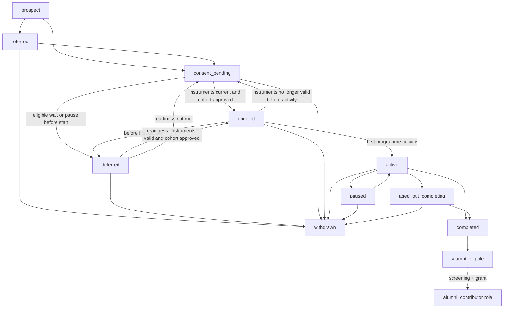
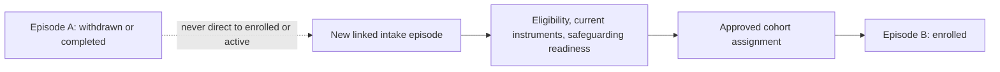

# R2 — YDG longitudinal journey architecture

**Milestone:** Reconstruction R2 — specification only.\
**Status:** Implementation-ready planning. No UI, schema, migration, recruitment or personal-data collection.\
**Programme home:** Youth Discovery Gateway remains a Capacity Building programme. Public routes stay at `/capacity-building/ydg`, `/capacity-building/ydg/how-it-works` and `/capacity-building/ydg/tracks`.

This document is the authoritative R2 source for roles, lifecycle, age/education modelling, and journey concepts. It extends, and does not weaken, `MVP_ROLE_AND_JOURNEY_BOUNDARIES.md`, `MVP_DOMAIN_AND_EVENT_MODEL.md`, `MVP_SECURITY_PRIVACY_AND_SAFEGUARDING_BOUNDARIES.md`, and the 4B authentication foundation.

Companion documents:

| File | Covers |
|------|--------|
| `R2_CONSENT_SAFEGUARDING_AND_PRIVACY.md` | Consent/assent/acknowledgement/media; safeguarding segregation; privacy, retention, audit and access gates |
| `R2_EXPERIENCE_IA_AND_IMPLEMENTATION.md` | Per-role dashboards, engagement model, phase boundaries, backend/API map, acceptance and implementation sequence |
| `MVP_IMPLEMENTATION_ROADMAP.md` | R2 position, dependencies and later increments |

---

## Purpose

Define how a YDG participant is tracked from their actual point of entry through upper primary, JHS, SHS, tertiary/TVET and exploratory transition toward work or entrepreneurship. Participants may join at different ages and education stages. **Age, consent band, track, cohort, UNFOLD stage and education stage remain independent fields.**

R2 does not collect new personal information, open applications, or activate live recruitment.

---

## Non-goals

- Do not change the approved public UI, navigation, routes, branding or safeguarding language.
- Do not build a mentorship marketplace, public social network, automated matching, automated placements or applicant ranking.
- Do not imply guaranteed tertiary admission, employment, income, placement or impact.
- Do not add direct messaging or broad community feeds to the first authenticated release.
- Do not create migrations, alter Supabase, implement dashboards, or change authentication architecture.

---

## Experience principles

1. The authenticated experience is a **guided journey**, not an administrative portal.
2. Every participant sees **My Journey**: current stage, completed milestones, next actions and transition goals.
3. Track-specific activities, reflections, project evidence and achievements are first-class. **No scores, rankings or public comparisons.**
4. Cohort engagement, mentor-led activities and participant showcases are **assigned, moderated and approved**.
5. **Execute** remains the canonical UNFOLD progression term. Do not rename it Launch, Delivery or equivalent.
6. Selection stays eligibility verification, structured interview and documented panel rationale (`selectionStatement`). Gender reporting uses the approved girls’ enrolment commitment, never as an individual merit score.

---

## Source of truth preserved

| Topic | Canonical source |
|-------|------------------|
| Ages 10–25; tracks 10–13 / 14–15 / 16–17 / 18–25 | Public tracks page; `programmeFacts` |
| UNFOLD: Play → Discover → Explore → Experience → Prepare → **Execute** → Mentor | `/capacity-building/ydg/how-it-works` |
| Consent 10–17 vs 18–25; media optional; identity-reuse rule | `/parents`; 4A security spec |
| Ages 10–12 extra safeguarding approval | `PHASE1_LIMITATIONS.md` |
| Anti-guarantee copy | `boundaryStatement` |
| Auth: protected claims, fail-closed, `/admin` 404 | 4B foundation; `lib/auth/roles.ts` |
| Recruitment closed | `recruitmentClosedStatement` |

---

## 1. Authoritative role and permission matrix

Participant age bands are **permission templates on the same Participant entity**, not separate products.

### Journey roles (R2)

| Role | Intent | Account | 4B code token |
|------|--------|---------|---------------|
| Participant 10–17 | Assent, My Journey, assigned activities | Optional; usually after Gate M and a verified adult relationship | `participant` + minor consent band |
| Participant 18–25 | Legal consent, My Journey, assigned activities | Expected after 4C/4E | `participant` + adult consent band |
| Parent or legal guardian | Programme consent for linked minor; scoped visibility | Expected when linked | `parent` / `legal_guardian` |
| Approved responsible adult | Scoped consent, acknowledgement or pickup where formally approved | Expected when approved | `approved_responsible_adult` |
| Mentor | Screened support for assigned people/cohorts | After screening | `mentor` |
| Facilitator | Lead assigned sessions | After screening | `facilitator` |
| Programme operations staff | Intake, cohorts, assignments, operational reports | Required | `programme_operations` |
| Safeguarding Lead | Exceptions, case assignment, org safeguarding | Required | `safeguarding_lead` |
| School or institutional partner | Nomination / partnership only | Expected for live referral | `referrer` until an approved implementation pass adds an alias |
| Approved alumni contributor | Screened giving-back; approved showcases or assigned alumni activity | After completion **and** screening | **Not in 4B `programmeRoles`.** Do not add in code during R2 |

### Supporting roles (unchanged from 4A/4B)

Restricted safeguarding caseworker, system administrator and read-only auditor remain as specified. Administrators do not inherit case access. Alumni contributor is never granted by finishing Execute.

### Permission legend

**Y** allow · **N** deny by default · **L** linked minor / approved relationship only · **A** assigned cohort, participant, activity or case only · **E** documented Safeguarding Lead exception · **M** restriction marker only, no case body · **S** approved showcase or shared-class evidence only · **P** explicit policy grant.

| Capability | P17 | P25 | Gd | ARA | Mn | Fc | Ops | SL | IP | Al |
|------------|:---:|:---:|:--:|:---:|:--:|:--:|:---:|:--:|:--:|:--:|
| Use public information site | Y | Y | Y | Y | Y | Y | Y | Y | Y | Y |
| Hold an account in first authenticated release | P | Y | Y | Y | Y | Y | Y | Y | Y | P |
| View own My Journey | Y | Y | N | N | N | N | N | N | N | N |
| View linked-minor progress (redacted, no private reflections) | N | N | L | P | N | N | Y | N | N | N |
| View nominated referral status only | N | N | N | N | N | N | Y | N | A | N |
| Record 10–17 programme consent | N | N | L | E | N | N | N | E | N | N |
| Record 10–17 assent | Y | N | N | N | N | N | N | N | N | N |
| Record 18–25 legal consent | N | Y | N | N | N | N | N | N | N | N |
| Record 18–25 adult acknowledgement | N | N | L | L | N | N | N | E | N | N |
| Record or withdraw media consent | L* | Y | L | P | N | N | N | N | N | S |
| Update own education stage / transition goal | N | Y | L | N | N | A | Y | N | N | N |
| Complete assigned activities | A | A | N | N | N | N | N | N | N | A |
| Write private reflections | Y | Y | N | N | N | N | N | N | N | N |
| Read private reflections | own | own | N | N | N | N | N | N | N | N |
| Read activity evidence / structured reviews | own | own | L | P | A | A | Y | N | N | A |
| Write structured review (not a score) | N | N | N | N | A | A | Y | N | N | N |
| Submit showcase candidate | S | S | N | N | N | N | N | N | N | S |
| Approve showcase | N | N | N | N | N | A | Y | N | N | N |
| Structured mentor interaction (assigned, auditable) | A | A | N | N | A | A | Y | N | N | A |
| Direct messaging / community feed | N | N | N | N | N | N | N | N | N | N |
| Assign track, cohort, UNFOLD stage | N | N | N | N | N | A | Y | N | N | N |
| Assign mentor / facilitator / alumni activity | N | N | N | N | N | N | Y | N | N | N |
| Record attendance | N | N | N | N | A | A | Y | N | N | N |
| Submit referral / nomination | N | N | N | N | N | N | Y | N | Y | N |
| See safeguarding restriction marker | P | P | N | N | A | A | M | Y | N | N |
| Open or read safeguarding case | N | N | N | N | N | N | N | Y | N | N |
| Grant alumni contributor role | N | N | N | N | N | N | Y | P | N | N |

\*Media consent for 10–17 is recorded by the guardian (or approved alternative adult), with optional participant view of the current state. Refusal never affects place.

**Hard rules**

- Mentors, facilitators, parents, ARAs, institutions and alumni do **not** receive unrestricted private reflections or any safeguarding case body.
- Guardian visibility does not transfer to an ARA unless policy grants it.
- Institutional partners never receive a cohort roster or evidence library.
- Knowing an email, phone or participant id does not create a relationship (`AUTHENTICATION_AND_AUTHORIZATION_SPECIFICATION.md`).
- Concurrent conflicting roles need explicit policy, not inheritance.

---

## 2. Participant lifecycle and state transitions

Status belongs to a **participation/enrolment episode**, not to the Person for all time. A Participant identity may have many episodes. The current status is the status of the current episode. Historical episodes stay at their terminal status.

**Happy path (one episode):**

`prospect` → `referred` → `consent_pending` → `enrolled` → `active` ⇄ `paused` → `completed`

**Pre-activity holding:**

`consent_pending` | `enrolled` → `deferred` → `enrolled` (readiness met) | `consent_pending` (readiness not met)

**Episode terminals:**

`withdrawn` | `completed`

`aged_out_completing` is an in-delivery finishing state on the same episode (`active` → `aged_out_completing` → `completed`). `alumni_eligible` is a journey-level flag after `completed`, not an enrolment status. `alumni_contributor` is a separate **role grant**.

Every status transition must be **authorised, timestamped and auditable** (typically `ParticipationStatusChanged`, plus the enrolment and withdrawal events below).

| Status | Meaning | Permitted from | Permitted to |
|--------|---------|----------------|--------------|
| `prospect` | Pre-intake interest | — | `referred`, `consent_pending` |
| `referred` | Nomination received; not enrolled | `prospect` | `consent_pending`, `withdrawn` |
| `consent_pending` | Required instruments incomplete or must be re-collected | `prospect`, `referred`, `deferred`, `enrolled` (before first activity, instruments no longer valid) | `enrolled`, `deferred`, `withdrawn` |
| `deferred` | Eligible, but programme activity has **not** begun: no cohort available, or participant/family pauses before start | `consent_pending`, `enrolled` (before first programme activity only) | `enrolled`, `consent_pending`, `withdrawn` |
| `enrolled` | Required instruments current and a cohort assignment approved; activity not yet started | `consent_pending`, `deferred` | `active`, `deferred`, `consent_pending`, `withdrawn` |
| `active` | Programme activity has begun | `enrolled`, `paused` | `paused`, `withdrawn`, `completed`, `aged_out_completing` |
| `paused` | In-delivery interruption after activity began | `active` | `active`, `withdrawn` |
| `aged_out_completing` | Turns 26 during an active cohort; may finish that cohort only | `active` | `completed`, `withdrawn` |
| `completed` | Finished this episode’s cohort or agreed segment. **Does not entitle the next track.** Terminal for the episode | `active`, `aged_out_completing` | none on this episode |
| `withdrawn` | Required consent/assent/legal consent ended, or the family/participant withdrew this episode. **Terminal for the episode** | `referred`, `consent_pending`, `deferred`, `enrolled`, `active`, `paused`, `aged_out_completing` | none on this episode |

`alumni_eligible` may be set after `completed`. It is not a status on the table above. Screening plus an authorised grant creates the `alumni_contributor` role; finishing Execute never grants it.

### Deferred (pre-activity only)

`deferred` is not a softer form of `paused`. An actively participating person (`active` or `paused`) must not be moved to `deferred`.

Entry is allowed only **before programme activity begins**:

- from `consent_pending`, when the person is otherwise eligible but no cohort is available, or the participant/family pauses before starting;
- from `enrolled`, when the approved start has not occurred (cohort delayed or pause before first attendance).

Return from `deferred` must pass a **readiness checkpoint**:

- to `enrolled` only when required consent/assent/acknowledgement remains valid **and** a cohort assignment is approved;
- otherwise to `consent_pending`;
- to `withdrawn` if this episode is ended.

### Withdrawal and re-entry

`withdrawn` is **terminal for the affected participation/enrolment episode**. A returning person does **not** transition from `withdrawn` to `active` or `enrolled`.

Re-entry creates a **new linked intake/enrolment episode** under the same participant identity. The previous episode remains immutable history. Re-entry requires current eligibility verification, current consent/assent/acknowledgement instruments, safeguarding readiness, and an approved cohort assignment. It does **not** guarantee acceptance, or continuation at the previous track or UNFOLD stage.

Withdrawal must never erase historical attendance, consent changes, audit events, or safeguarding retention obligations.

The same episode-terminal rule applies to `completed`: a later track or cohort is a new enrolment after `TransitionReviewCompleted` and an authorised assignment, not `completed` → `active`.

`withdrawn` and `completed` have no outbound episode edges. Re-entry is a new episode:

Entry to an episode is recorded, never assumed:

| Field | Rule |
|-------|------|
| Entry path | `enquiry` \| `referral` \| `family` \| `school` \| `amusement_interest` \| `other` |
| Entry track | Age-eligible track on official cohort first day |
| Entry UNFOLD stage | Assigned. Later-track entrants may start at Explore, Experience or Prepare |
| Entry education stage | Captured independently at intake |

Withdrawal of required programme consent (10–17), assent (10–17) or legal consent (18–25) ends the **current episode** as `withdrawn`. Media refusal does not.

---

## 3. Education-stage and age-band model

These dimensions must never be inferred from one another.

### Age

| Concept | Rule |
|---------|------|
| Programme eligibility | 10–25 |
| Age for track assignment | Counted on the official first day of the cohort |
| Consent band | 10–17 minor · 18–25 adult participant |
| Extra safeguarding band | 10–12 inside Discovery Gateway; recruitment of this band needs age-specific approval |
| Age 26 | May finish the active cohort; cannot begin another standard participant cohort |

Date of birth is **not collected in R2**. When later collected under Gate M / adult privacy notice, age-at-cohort-start is derived; the consent band is derived; education stage is still entered explicitly.

### Education stage (current context)

4A already recorded:

`upper_primary` \| `jhs` \| `shs` \| `tertiary` \| `other`

R2 proposes one **new** first-class value, **`tvet`**, for technical/vocational education and training. **Owner confirmation is still pending.** Do not encode TVET as `other`. Do not treat `tvet` as an approved education-stage enum until that decision is recorded.

| Value | Status | Use |
|-------|--------|-----|
| `upper_primary` | 4A approved | Upper primary |
| `jhs` | 4A approved | Junior high school |
| `shs` | 4A approved | Senior high school |
| `tertiary` | 4A approved | University or equivalent higher education |
| `other` | 4A approved | Out of school, alternative, or not listed — **not** a residual for TVET |
| `tvet` | **Pending owner confirmation** | Proposed first-class TVET stage; not approved for implementation yet |

Education stage may change while track stays the same (for example a Direction participant moving from JHS to SHS). Track may change at a new cohort while education stage stays the same. Either change requires `TransitionReviewCompleted` at that boundary.

### Transition goal (exploratory, not an outcome)

Independent of education stage and never stored as a promised result:

`not_yet_set` \| `continue_education` \| `tvet` \| `work_exploration` \| `entrepreneurship_exploration` \| `undecided`

Work and entrepreneurship are **transition goals**, not education stages and not placements. The transition-goal label `tvet` names an exploratory destination; it does **not** approve `tvet` as an education-stage enum. Separately approved placements, if they ever exist, are operational records with no guarantee language.

### Track (age-based, unchanged)

| Track | Cohort-start ages |
|-------|-------------------|
| Discovery Gateway | 10–13 |
| Foundation | 14–15 |
| Direction | 16–17 |
| Execution & Progression | 18–25 |

Track is an enrolment attribute. It is not computed from school year.

---

## 4. Journey, cohort, track, milestone, activity, evidence and review

| Concept | Meaning | Notes |
|---------|---------|-------|
| **Journey** | Longitudinal programme record for one Participant | Spans cohorts; holds current UNFOLD stage, education stage, transition goal and entry path |
| **Cohort** | Named, time-bounded delivery group with an intended track | Amusement events are a different offering |
| **Enrolment** | Participant in a Cohort, with track and start/end | One **current** enrolment at a time. Ended or transferred enrolments remain historical |
| **Track** | Age-based lane on that enrolment | See table above |
| **UNFOLD stage** | Play → Discover → Explore → Experience → Prepare → **Execute** → Mentor | Assigned; stage change is an event |
| **Milestone** | Named checkpoint on the journey (profile, plan, portfolio item) | Not a score |
| **Activity** | Assigned session, task or mentor-led exercise | Track-specific templates allowed |
| **EvidenceItem** | Structured observation, reflection, or later file reference | Visibility class required |
| **Review** | Facilitator/mentor qualitative feedback on assigned evidence | No numeric mark, rank or displayed total |
| **Transition review** | Evidence-informed checkpoint at a cohort, track or education-stage boundary | Event: `TransitionReviewCompleted`. Rationale and agreed next steps only |
| **ShowcaseItem** | Approved excerpt of evidence for a defined audience | Media consent if identifiable; withdrawal starts restriction/removal |

### Evidence visibility classes

| Class | Default readers |
|-------|-----------------|
| `private_reflection` | Owning participant only |
| `activity_evidence` | Owner, assigned mentor/facilitator, programme operations |
| `family_visible` | Owner plus linked guardian (10–17) or explicit 18–25 share |
| `showcase_candidate` | Owner plus ops/facilitator reviewers |
| `showcase_approved` | Audience named on the approval (cohort, family, or later public page) |

A reflection that raises a safeguarding concern is **escalated as a concern**, not opened as a case on a mentor or operations dashboard.

### Two delivery layers (unchanged public model)

Every track still runs:

1. **Discovery & Direction Pathway** — self-discovery, practical challenges, supervised exposure, portfolio.
2. **Essential Life Capability Spine** — digital safety, basic financial capability, communication and self-management.

Activities and milestones may attach to either layer. They do not create a second scoring system.

### Transition review

`TransitionReviewCompleted` is the domain checkpoint at a **cohort, track or education-stage** boundary. It records:

- who authorised the review;
- the boundary type (cohort, track, education stage);
- documented rationale;
- agreed next steps.

It must **not** contain a numeric score, ranking, guaranteed outcome, or automatic progression. Finishing a review does not create a right to the next track, UNFOLD stage, placement or enrolment. A later enrolment or transfer still requires a separate authorised assignment.

### Enrolment-change events

Enrolments are append-only as history. Ending or transferring must not overwrite the original row or silently re-point the participant.

| Event | Meaning |
|-------|---------|
| `EnrolmentCreated` | Opens a new enrolment episode (already in 4A). |
| `EnrolmentEnded` | Closes the named enrolment. The record remains historical (completed, withdrawn, transferred-away, or aged-out). |
| `EnrolmentTransferred` | Authorised move from enrolment A to a **new** enrolment B (another approved cohort and/or track). A is ended and retained; B is created. Eligibility and current consent/assent/acknowledgement are revalidated where the destination cohort, track or consent band requires it. |
| `ParticipationStatusChanged` | Auditable status transition on an episode, including into and out of `deferred`. |
| `WithdrawalConfirmed` | Ends the episode as `withdrawn` (already in 4A). |
| `TransitionReviewCompleted` | Evidence-informed boundary review, as above. |

A transfer is never `active` overwritten in place. Sequence: `TransitionReviewCompleted` (when the change is a cohort, track or education boundary) → `EnrolmentEnded` on A → `EnrolmentCreated` for B → `EnrolmentTransferred` linking A to B. All four are authorised and auditable. Re-entry after `withdrawn` uses a new intake episode and `EnrolmentCreated`; it does not emit `EnrolmentTransferred` from the withdrawn episode.

